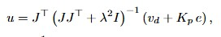
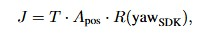

# Cinemática inversa diferencial

La referencia de trayectoria avanza por longitud de arco, con perfil de aceleración/frenado de 0.4 m/s² y reducción a velocidad nula en esquinas de 45° o más, en lugar de detenerse en cada punto interpolado de la densificación geométrica. En cada ciclo de control se calcula el error de posición en el marco Vicon estimado, e = q_d - q_realim, y la velocidad tangente de referencia v_d, y se resuelve

con K_p = 1.8 s⁻¹ y λ = 0.01 (pseudoinversa amortiguada de Levenberg–Marquardt), donde u = [v_x^cuerpo, v_y^cuerpo] se envía como `chassis.drive_speed(x=u[0], y=u[1], z=0, timeout=0.3)`. El jacobiano efectivo es

donde A_pos es la derivada de la red respecto a la posición odométrica, T alinea el marco aprendido con el marco Vicon de la sesión (obtenido por descomposición en valores singulares en la calibración de origen/orientación) y R(·) rota las velocidades del cuerpo al marco fijo de odometría. Un controlador secundario de encabezado (K_p^yaw = 1.5 s⁻¹, banda muerta de 1°, límite de 1.2 rad/s) mantiene la orientación de referencia de forma independiente del lazo de posición. Los comandos de velocidad están acotados en norma a 3.5 m/s (límite conservador del SDK) y su tasa de cambio a 1.2 m/s², deliberadamente mayor que la aceleración de 0.4 m/s² de la propia referencia, de modo que el término proporcional de corrección de error no compita por el mismo presupuesto de aceleración que el seguimiento de la referencia. La tolerancia de llegada al punto final es de 3.5 cm.

Es importante notar que esta cinemática inversa *no* invierte de forma única toda la matriz 6×12 de la red: sólo se invierte el bloque de posición (2×2) manteniendo fijas o realimentadas las diez características restantes, y el jacobiano se recalcula en cada ciclo a partir del yaw medido, pero *no* se reentrena en línea. La red preentrenada, por tanto, actúa como un modelo estático dentro del lazo; cualquier no linealidad del robot real no capturada en el entrenamiento (deslizamiento de ruedas, fricción del piso, variación de la ganancia efectiva con el estado de la batería) se traduce en error residual que el término proporcional debe corregir ciclo a ciclo.