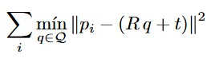

# Metodología de validación

## Trayectorias evaluadas
Se registraron con el sistema Vicon (100 Hz, objeto rígido *equipo_juan*) cinco recorridos autónomos: círculo de radio nominal 1.0 m, círculo de radio nominal 0.2 m, cuadrado de lado nominal 1.0 m, figura en ocho (lemniscata) de semiamplitud nominal 1.0 m, y zigzag de 1.0 m de lado cubriendo un área de 1 m² en cuatro pasadas horizontales. El tamaño nominal de cada figura se tomó directamente del nombre de archivo de la captura correspondiente, tal como fue registrado durante el experimento.

## Alineación real–ideal
Dado que el origen y la orientación con los que se calibró cada recorrido en el marco Vicon no necesariamente coinciden con el origen matemático de la figura ideal, la trayectoria real se comparó contra la referencia ideal mediante un algoritmo Iterative Closest Point (ICP) 2D de cuerpo rígido: se buscó la rotación R en SO(2) y traslación t en R² que minimizan

donde {p_i} son los puntos medidos por Vicon y Q es la curva ideal densamente muestreada, sin permitir reescalamiento (el tamaño de la figura ideal se fija al valor nominal). El error de seguimiento reportado para cada muestra es la distancia euclidiana de ese punto a la curva ideal ya alineada.