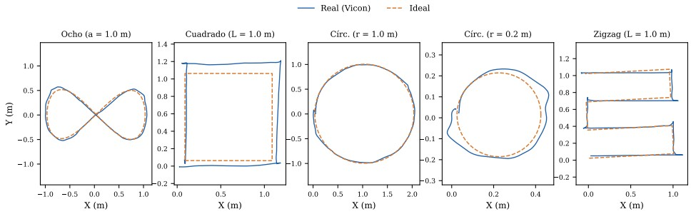
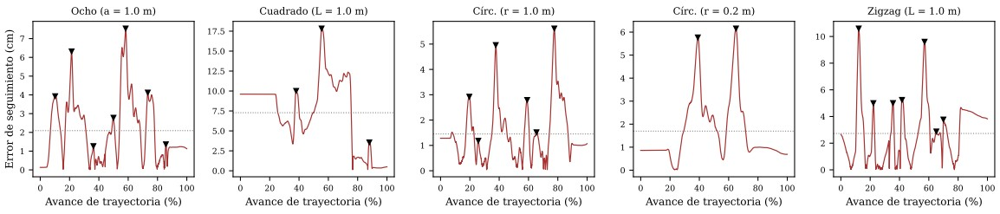
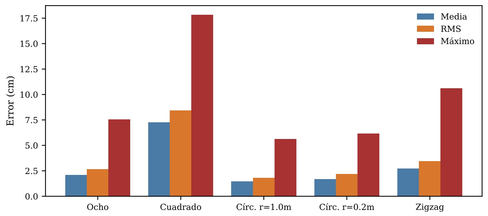

# Resultados

## Superposición de trayectorias
La figura muestra, para las cinco figuras, la trayectoria realmente recorrida (medida por Vicon) superpuesta a la trayectoria ideal alineada. La altura Z se mantuvo dentro del plano calibrado en todos los casos (desviación estándar entre 1.5 mm y 6.4 mm respecto a una media de aproximadamente 11.8 cm), consistente con la tolerancia de planitud de ±2 cm especificada para la ejecución de trayectorias.

## Error de seguimiento y picos de corrección
La siguiente gráfica presenta el error instantáneo (distancia a la curva ideal) en función del avance porcentual de cada trayectoria, con los picos locales marcados. La tabla resume el error medio, RMS y máximo por figura, y la última gráfica los compara en conjunto.

**Tabla:** Métricas de error de seguimiento por figura (cm).

| Figura | n | Dur. (s) | Media | RMS | Máx. |
| :--- | :---: | :---: | :---: | :---: | :---: |
| Ocho (a = 1.0 m) | 2132 | 21.3 | 2.09 | 2.68 | 7.54 |
| Cuadrado (L = 1.0 m) | 2181 | 21.8 | 7.28 | 8.44 | 17.84 |
| Círculo (r = 1.0 m) | 1952 | 19.5 | 1.45 | 1.82 | 5.62 |
| Círculo (r = 0.2 m) | 1022 | 10.2 | 1.70 | 2.19 | 6.16 |
| Zigzag (L = 1.0 m) | 2382 | 23.8 | 2.73 | 3.46 | 10.60 |

Dos observaciones se desprenden directamente de la gráfica de errores:

1. En las figuras con esquinas (cuadrado, zigzag) los picos de error de mayor magnitud (hasta 17.8 cm en el cuadrado y 10.6 cm en el zigzag) ocurren en los tramos donde la referencia reduce su velocidad a cero para respetar el giro de 45° o más, mientras que en las figuras suaves (círculos, ocho) los picos —de menor amplitud relativa, hasta 7.5 cm— coinciden con los puntos de mayor curvatura (el cruce central del ocho, y prácticamente cualquier punto de un círculo pequeño, donde la curvatura es uniformemente alta).
2. Como evidencia de la *capacidad de corrección* del controlador: después de cada pico el error decae de forma monótona hasta volver a un nivel cercano a la media de la figura (líneas punteadas grises) antes de que ocurra la siguiente perturbación, es decir, el término proporcional K_p · e logra reabsorber el error introducido en cada esquina o zona de alta curvatura dentro de la siguiente fracción del recorrido, en vez de acumularlo indefinidamente. El caso del cuadrado es el que más tarda en recuperarse (la meseta elevada entre 40 % y 75 % de avance), consistente con que su error medio (7.28 cm) y su error máximo (17.84 cm) son, con amplio margen, los mayores de las cinco figuras.

## Acumulación de error en la cinemática inversa
El error observado en cada figura no proviene de una sola causa, sino de la composición de al menos tres fuentes que se acumulan a lo largo del lazo cerrado:

1. **Sesgo del modelo aprendido:** El RMSE de posición de la red en la partición de prueba cronológica (7.15 cm) es del mismo orden de magnitud que el error medio observado en las figuras más exigentes (cuadrado, zigzag). Como la red no se reentrena durante el recorrido, cualquier desviación entre la dinámica real del robot en el momento de la prueba y la que tenía durante el entrenamiento se traduce directamente en un sesgo de estimación de posición que el controlador "ve" como si fuera la posición real.
2. **Estructura parcial del jacobiano:** La inversión sólo opera sobre el bloque de posición XY de la red (2×2), manteniendo fijas o realimentadas de forma aproximada las diez características restantes (actitud, comandos previos, velocidades odométricas). Esto es necesario porque no existe una inversa única de la matriz completa 6×12, pero implica que los efectos cruzados entre, por ejemplo, la actitud real del robot y la posición estimada no se corrigen de forma exacta, sino sólo a través de la realimentación del error de posición en el siguiente ciclo.
3. **Retención causal y actualización parcial a 10 Hz:** Únicamente la corrección posicional rápida se actualiza a la tasa de telemetría (50 Hz); el resto del vector de entrada de la red —actitud acumulada, últimos comandos y velocidades odométricas— sólo se refresca cada 0.1 s. Entre esas actualizaciones, la estimación de posición puede desviarse ligeramente del estado real del robot, en particular durante los giros de esquina donde la actitud cambia con mayor rapidez.

Estas tres fuentes son consistentes con el patrón observado: las figuras con esquinas pronunciadas (cuadrado, zigzag), donde la actitud del robot cambia de forma abrupta y rápida, presentan errores medios y picos sistemáticamente mayores que las figuras de curvatura suave o constante (círculos), donde el vector de características de 12 componentes cambia de forma mucho más gradual entre actualizaciones de 10 Hz. Cabe además señalar —con base en pruebas de verificación en lazo cerrado sobre una planta cinemática simulada, documentadas junto con el sistema— que la realimentación basada únicamente en la red puede alcanzar el objetivo *según la propia estimación de la red* conservando un error físico varias veces mayor al error estimado (por ejemplo, 3.2 cm de error estimado frente a 15.8 cm de error físico simulado en un caso de prueba puntual), mientras que la medición óptica en vivo, cuando está disponible, expone y corrige ese error físico de forma directa. El presente reporte, al validar con Vicon como instrumento externo e independiente del lazo, sí captura ese error físico real y no únicamente el que la red cree haber cometido.

## Discusión por figura
La figura en ocho, señalada como una de las más relevantes de esta evaluación, exhibe un error medio de 2.09 cm y RMS de 2.68 cm, notablemente menor que el del cuadrado y comparable al de los círculos, pese a combinar dos lóbulos de curvatura opuesta y un cruce central donde la dirección de avance se invierte. Esto indica que el controlador maneja razonablemente bien los cambios de curvatura continuos —incluida la inversión de sentido de giro en el cruce, visible como el pico de 7.54 cm (el mayor de la figura) cercano al 58 % del recorrido— siempre que no se le exija además detenerse por completo, como sí ocurre en las esquinas de 45° o más del cuadrado y el zigzag. El círculo pequeño (0.2 m de radio) presenta un error medio similar al del círculo grande a pesar de que su tamaño es cinco veces menor, lo que en términos relativos representa un error proporcionalmente mayor respecto al tamaño de la figura, y es consistente con que a menor radio la curvatura requerida es mayor y el margen entre la velocidad de referencia y el límite de aceleración de comando (1.2 m/s²) se reduce.

## Demostraciones de trayectorias

<video controls width="720">
  <source src="{{ '/assets/videos/ocho.mp4' }}" type="video/mp4">
  Tu navegador no soporta video HTML5.
</video>

# Conclusiones
Se documentó y validó experimentalmente un esquema de seguimiento de trayectorias para el DJI RoboMaster S1 que reemplaza la medición óptica en línea por la inversión diferencial del jacobiano de una red neuronal lineal 12 -> 6 entrenada fuera de línea para estimar la pose Vicon a partir de telemetría interna. La validación independiente con el propio sistema Vicon, sobre cinco figuras geométricas de tamaño nominal conocido, muestra errores de seguimiento medios de entre 1.4 y 7.3 cm y máximos de hasta 17.8 cm, con el cuadrado como la figura más exigente por la combinación de esquinas de 90° y detenciones de la referencia, y el ocho y los círculos como las figuras con mejor desempeño relativo. 

Los picos de error transitorios en esquinas y zonas de alta curvatura, seguidos de una recuperación consistente hacia el nivel medio de error de cada figura, evidencian que el término proporcional del controlador cumple su función de corrección, aunque queda acotado por los límites de frecuencia de telemetría y comando del RoboMaster S1 (50 Hz de suscripción de pose, actualización de características a 10 Hz, vigilancia de comando de 0.3 s) y por el sesgo propio de invertir un modelo aprendido en lugar de medir físicamente. Trabajo futuro debería incorporar una segunda sesión de entrenamiento verdaderamente independiente para acotar mejor la generalización de la red, así como comparar de forma sistemática el modo de realimentación óptica en vivo (`vicon_udp`) contra el basado exclusivamente en la red bajo las mismas cinco figuras aquí evaluadas.